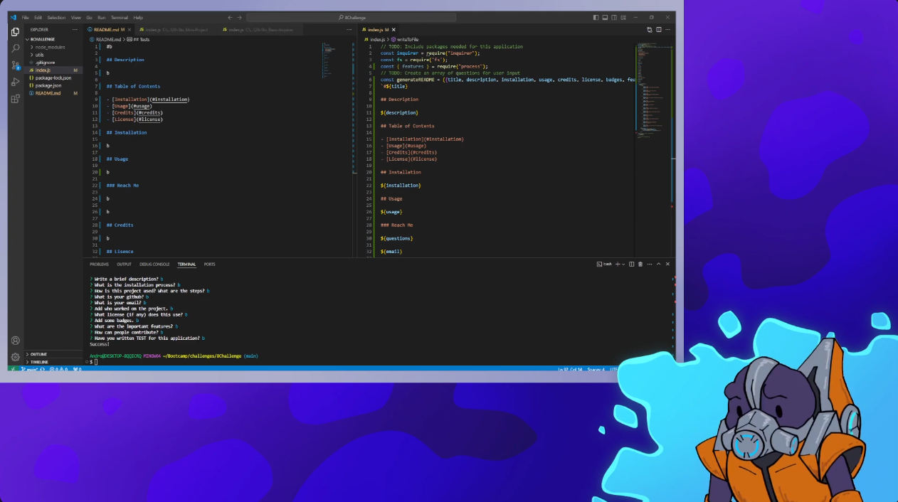

#README Master

## Description

This is a program that creates README.md files for you in the terminal using Node.js and NPM Inquirer.

## Table of Contents

- [Installation](#installation)
- [Usage](#usage)
- [Credits](#credits)
- [License](#license)

## Installation

You can install this by copying the index.js file and running it through a terminal that has node.js connected.

## Usage

Answer the prompts given to you by the terminal.

### Reach Me

For any questions please contact https://github.com/BunggoyLearn

fakeemail@nowaylol.com

## Credits

Made with goof by Bung

## Lisence

Made with Creative Commons License

## Badges

https://img.shields.io/badge/npm-_inquirer-black

## Features

N/A

## How to Contribute

You can’t

## Tests

I wrote no tests for this

## Video Demo

